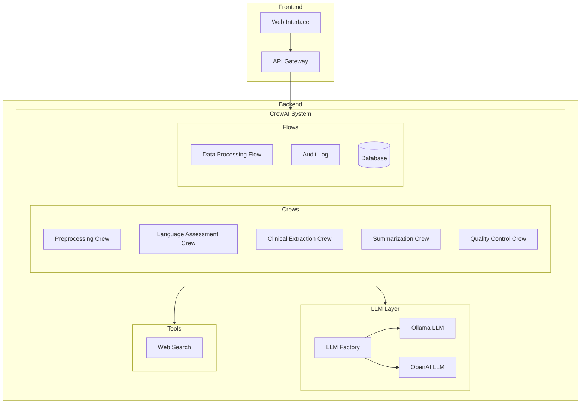
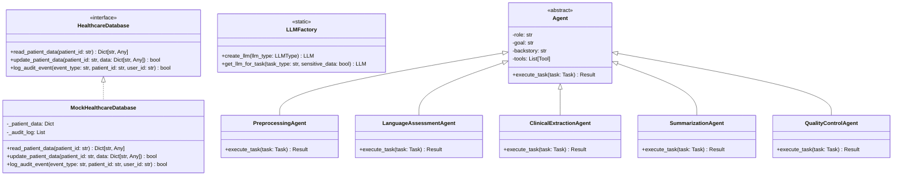
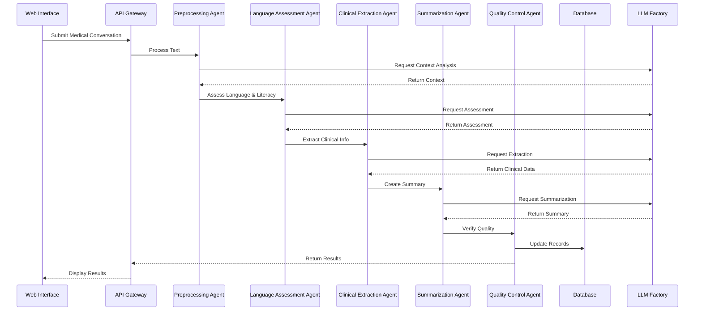

# System Architecture

## Component Diagram

## Class Diagram

## Sequence Diagram

## Component Descriptions

### Frontend Components
- **Web Interface**: User-facing application for submitting medical conversations and viewing results
- **API Gateway**: Handles authentication, request routing, and response formatting

### Backend Components
- **CrewAI System**: Core orchestration layer managing agents and workflows
  - **Crews**: Autonomous agent teams for complex tasks
  - **Flows**: Structured processes for deterministic operations
- **LLM Layer**: Language model management and selection
- **Tools**: External service integrations and utilities

### Data Flow
1. Medical conversations enter through the Web Interface
2. API Gateway validates and routes requests
3. CrewAI System processes the conversation through specialized agents
4. Results are stored in the database and returned to the user 